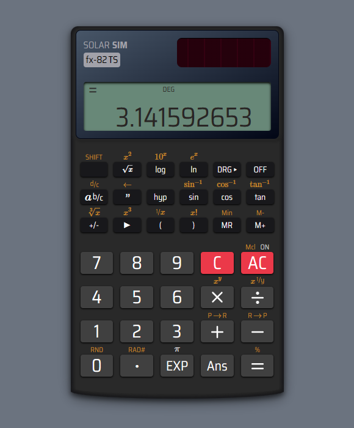

# 🧮 Scientific Calculator

This TypeScript-powered calculator faithfully replicates the beloved user interface design of the classic CASIO scientific calculators, using React and Tailwind CSS.



Live Demo: [https://solarsim-fx82ts.netlify.app/](https://solarsim-fx82ts.netlify.app/)

## Installation

*Before getting started, please ensure that you have Node.js version 20 or higher installed on your system.*

Install the project dependencies by running:

```bash
$ npm i
```

## Usage

To run the Calculator app locally on your development server, execute the following command:

```bash
$ npm start
```

This will start the development server and open the Calculator app in your default web browser. Alternatively, you can navigate to http://localhost:3000 in your browser to access the app.

## Testing

To run the test suite, use the following command:

```bash
$ npm t
```

## License

This project is licensed under the MIT License.
